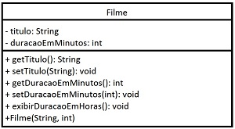
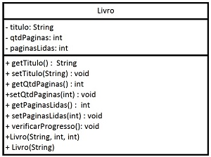

# Aula 6

## Exercícios resolvidos por Xico em sala de aula
1. Aprimoramento da classe Contato, com classe Pessoa, Endereço, Estado, CEP.

## Exercícios para os alunos - 3,0 pontos se entregar até ??/09/2022
2. Construa a classe Filme em Java, que obedeça à descrição abaixo:

A classe deve possuir dois atributos privados: titulo (do tipo String) e duracaoEmMinutos (do tipo int)
- Crie um construtor para a classe que recebe 2 parâmetros, cada um representando um dos atributos da
classe.
- Crie os métodos de acesso (get e set) para os atributos titulo e duracaoEmMinutos
- Crie um método exibirDuracaoEmHoras que converta o valor em minutos para horas e apresente a
mensagem “O filme TITULO possui X horas e Y minutos de duração”.
▪ Por exemplo, dado o filme com título Titanic que possui 194 minutos de duração, a mensagem que
deverá ser exibida para o usuário será:
“O filme Titanic possui 3 horas e 14 minutos de duração”
Crie uma classe TestarFilme que possua um método main de modo que seja possível testar a classe Filme criada na
questão anterior.
- Crie um objeto umFilmeQualquer do tipo Filme. Utilize o construtor da classe passando os valores “Os
Vingadores”, para o atributo título, e 142 para o atributo duracaoEmMinutos.
- Chame o método exibirDuracaoEmHoras() para mostrar quantas horas o filme possui.
- Crie um objeto meuFilmeFavorito do tipo Filme, cujo título deve ser o título do seu filme favorito e a
duração deve ser iniciada em 100 minutos.
- Altere o atributo duracaoEmMinutos do objeto meuFilmeFavorito para a duração correta do filme.
- Chame o método exibirDuracaoEmHoras() do objeto meuFilmeFavorito para mostrar quantas
horas/minutos o filme possui.
- Exiba a mensagem: “Os filmes no catálogo são X e Y”, onde no lugar de X, deverá aparecer o título do
umFilmeQualquer e no lugar de Y deverá aparecer o título do meuFilmeFavorito.

3. Crie a classe Livro que obedeça à descrição abaixo:

A classe possui os atributos titulo, qtdPaginas e paginasLidas. Esses atributos devem ser marcados com
o modificador de acesso private.
- Crie os métodos get e set para cada um dos atributos.
- Crie dois construtores para a classe: o primeiro recebe 3 parâmetros, representando cada um dos
atributos da classe. O segundo recebe apenas um parâmetro, representando o atributo título.
- Crie ainda o método verificarProgresso que deverá calcular a porcentagem de leitura do livro até o
momento. Para isso, devera usar os valores dos atributos qtdPaginas e paginasLidas, através da formula:
porcentagem = paginasLidas * 100 / qtdPaginas. O valor da porcentagem deverá ser mostrado na tela
conforme a mensagem “Você já leu X por cento do livro”, onde o valor de X é o valor calculado pela
fórmula apresentada anteriormente.
Crie uma classe TestarLivros. Essa classe possuirá apenas o método main que servirá para testar a classe Livros.
As seguintes ações devem ser realizadas:
- Crie um objeto pequenoPrincipe do tipo Livro. Utilize o construtor que recebe apenas o título como
parâmetro e passe o valor “O Pequeno Príncipe”;
- Altere o atributo qtdPaginas para 98. Utilize, para isso, o método setQtdPaginas;
- Escreva na tela a mensagem: “O livro X possui Y páginas”, onde no lugar de X deverá aparecer o valor do
atributo titulo e, no lugar de Y deverá aparecer o valor do atributo qtdPaginas do objeto
pequenoPrincipe. Utilize, para tanto, os métodos getTitulo e getQtdPaginas.
- Altere a quantidade de paginasLidas para 20;
- Chame o método verificarProgresso.
- Altere a quantidade de paginasLidas para 50;
- Chame o método verificarProgresso.
- Crie um novo objeto chamado meuLivro. Utilize o construtor que recebe os 3 parâmetros e passe as
informações do livro que você está lendo no momento (ou do último livro que você leu).
- Escreva na tela a mensagem: “O livro X possui Y páginas”, onde no lugar de X deverá aparecer o valor do
atributo titulo e, no lugar de Y deverá aparecer o valor do atributo qtdPaginas do objeto meuLivro.

1. 

Implemente uma classe Carro, com os seguintes atributos na classe:
Modelo,  Cor, Ano, Marca, Chassi, Proprietário, Velocidade máxima, Velocidade atual, Nr de portas, tem teto solar?
 Nr Marchas, tem cambio automatico? , Volume de combustível,

Faça o encapsulamento da classe Carro e seus atributos
Implemente o método acelera que aumenta a velocidade de 1 em 1 km/h
Implemente o método freia que para o carro – Velocidade = 0 km/h
Implemete o método troca marcha
Implemente o método reduz a marcha;
Todo veículo tem um proprietário obrigatoriamente (implemente um construtor de veículo passando o proprietário como parâmetro);
A marcha ré nao pode ser engatada se o a velocidade for superior a 0 KM/h;
Transforme o atributo Marca de um carro em uma classe Marca com nome, nrDeModelos, ano de lançamento e código identificador

Implemente um método que calcule a autonomia de viagem do veículo com base no consumo médio passado como parâmetro;
Todo veículo tem um proprietário obrigatoriamente (implemente um construtor de veículo passando o proprietário como parâmetro);
A marcha ré nao pode ser engatada se o a velocidade for superior a 0 KM/h;
Implemente um método que calcule a autonomia de viagem do veículo com base no consumo médio passado como parâmetro;
Implemente um método para exibir o volume de combustível 

Instancie um objeto da classe Carro, Pessoa, Endereço, Marca e relacione os objetos utilizando os métodos ou construtores quando necessário.

